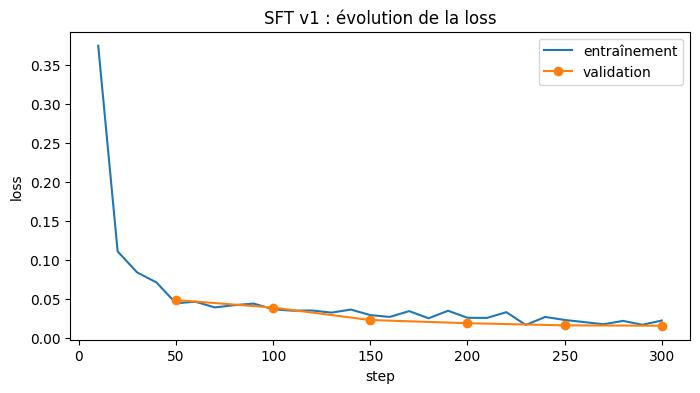
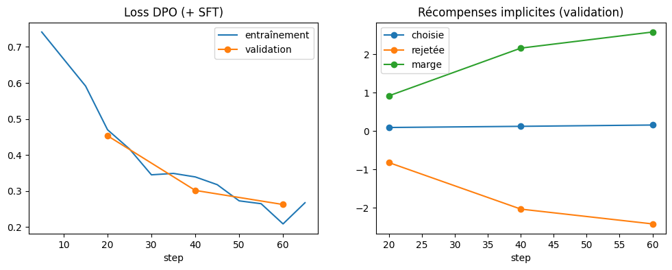

# Anonymisation RGPD de textes français par un petit LLM fine-tuné

Fine-tuning d'un petit modèle de langage, **Qwen2.5-0.5B-Instruct**, pour repérer et masquer
les données personnelles (noms, téléphones, adresses, e-mails, numéros d'identité...) dans des textes en français.

```
Entrée : Bonjour, je suis Sherap Iblikci et j'aimerais commander un puzzle.
Sortie : Bonjour, je suis [GIVENNAME] [SURNAME] et j'aimerais commander un puzzle.
```

## Problématique

Pour respecter le RGPD, entreprises, hôpitaux et administrations doivent anonymiser leurs documents.
Confier cette tâche à une API externe obligerait à lui envoyer les données que l'on cherche à protéger.

**Un petit modèle, fine-tuné et exécuté en local, peut-il anonymiser des textes de façon fiable ?**

## En bref

- **Sans entraînement**, le modèle ne sait pas faire la tâche : il ne masque que 25 % des données
  personnelles de textes réalistes.
- **Après fine-tuning SFT avec LoRA** (1,75 % des paramètres entraînés, 10 minutes sur un GPU T4),
  il en masque **97 %**, et 88 % des textes ne présentent plus aucune fuite.
- **L'alignement DPO** supprime les fuites restantes, mais le modèle se met à masquer des mots
  ordinaires et à modifier le texte : **le modèle SFT est retenu**.
- Un score de 99 % sur des données proches de l'entraînement ne suffisait pas : seuls un jeu de test
  réaliste et la lecture des sorties ont révélé les vraies limites de chaque modèle.

## Résultats

Trois modèles, évalués sur deux jeux de test :
- **synthétique** : 500 textes issus du même générateur que les données d'entraînement ;
- **réaliste** : 50 textes français (e-mails, SMS, formulaires médicaux, RH, administratifs),
  rédigés pour ce projet, avec des noms et formats français absents de l'entraînement.

| Test réaliste (50 textes) | Modèle de base | **SFT** | SFT + DPO |
|---|---|---|---|
| Protection (données personnelles masquées) | 25,0 % | **97,0 %** | 100 % |
| Textes sans aucune fuite | 24,0 % | **88,0 %** | 100 % |
| Préservation du texte non personnel | 38,3 % | **99,5 %** | 98,1 % |

| Test synthétique (500 textes) | Modèle de base | **SFT** | SFT + DPO |
|---|---|---|---|
| Protection | 42,9 % | **99,5 %** | 99,9 % |
| Textes sans aucune fuite | 39,8 % | **99,0 %** | 99,8 % |
| Préservation | 27,2 % | **99,7 %** | 99,3 % |

| Texte | Modèle de base | SFT |
|---|---|---|
| Bonjour, je suis Sherap Iblikci et j'aimerais commander un puzzle… | `**Sherap Iblikci**` `**Commande**` `**Puzzle**`… | Bonjour, je suis [GIVENNAME] [SURNAME] et j'aimerais commander un puzzle… |
| Disposez-vous d'une assurance responsabilité civile ? | `[YES]` | Disposez-vous d'une assurance responsabilité civile ? |

## Démarche

### 1. Données

Jeu de données [`ai4privacy/open-pii-masking-500k-ai4privacy`](https://huggingface.co/datasets/ai4privacy/open-pii-masking-500k-ai4privacy),
choisi pour sa licence (CC-BY-4.0, qui autorise la publication d'un modèle dérivé), filtré sur le
français : 90 000 exemples associant un texte, sa version anonymisée et la position de chaque donnée.

L'exploration ([notebook 01](notebooks/01-exploration-donnees.ipynb)) révèle des données
synthétiques imparfaites : phrases parfois incohérentes, annotation irrégulière des noms complets,
types d'entités très déséquilibrés, et quelques textes communs à l'entraînement et à la validation.
Après nettoyage ([`src/cleaning.py`](src/cleaning.py), [notebook 02](notebooks/02-preparation-donnees.ipynb)),
5 000 textes servent à l'entraînement et 500 forment le test synthétique, figé pour tous les modèles.

### 2. Évaluation

Une anonymisation se juge sur deux axes opposés, comme le rappel et la précision
([`src/evaluation.py`](src/evaluation.py)) :
- **protection** : les données personnelles ont-elles disparu ? Un oubli est une fuite ;
- **préservation** : le reste du texte est-il intact ? Sans elle, un modèle qui efface tout
  obtiendrait une protection parfaite ;
- **fidélité** : le modèle a-t-il ajouté ou modifié des mots ?

Avant toute évaluation, la métrique a été testée sur les réponses de référence, ce qui a permis
d'y corriger des faux positifs.

Le **jeu de test réaliste** ([`data/test_realiste.jsonl`](data/test_realiste.jsonl),
[guide d'annotation](docs/guide_annotation.md)) couvre les contextes médical, RH, service client,
administratif, bancaire et messagerie, avec des cas difficiles : prénoms qui sont aussi des noms
communs (Rose, Pierre), noms composés, formats de téléphone variés.

### 3. Modèle de base

Évalué sans entraînement avec la même consigne ([notebook 03](notebooks/03-baseline-v0.ipynb)) :
il recopie le texte sans le masquer, le transforme en liste de mots-clés ou répond aux questions
qu'il contient. Sa protection apparente vient surtout de la destruction du texte.

### 4. Fine-tuning SFT avec LoRA

[Notebook 04](notebooks/04-sft-v1.ipynb), avec `trl` et `peft` : LoRA de rang 16 sur l'attention et
le MLP (8,8 M paramètres entraînés sur 494 M), 1 époque sur 4 800 exemples, loss calculée uniquement
sur la réponse attendue.



Le modèle apprend le format de réponse en une vingtaine de steps, sans surapprentissage. Sur les
textes réalistes, il reconnaît tous les noms, y compris les plus ambigus, et tous les identifiants
français (sécurité sociale, numéro fiscal, permis).

Ses fuites ([notebook 05](notebooks/05-test-realiste.ipynb)) se concentrent sur des formats absents
des données d'entraînement : heures en « 17h15 », dates comme « mardi 8 avril », noms de rue
composés de mots courants (« rue de la République »).

### 5. Alignement DPO

[Notebook 06](notebooks/06-dpo-v3.ipynb), [`src/dpo.py`](src/dpo.py) : 1 200 paires de préférences
(une bonne réponse face à une mauvaise), construites à partir de textes ciblant ces faiblesses.
Quand le modèle SFT se trompe, c'est sa propre erreur qui sert de mauvaise réponse (28 % des paires).
Les textes d'entraînement sont distincts du test réaliste, ce que vérifie un test automatique.



Toutes les fuites disparaissent, mais la lecture des sorties révèle une **sur-optimisation** :
- des mots ordinaires masqués : « carte Vitale » → « carte [CITY] », « lundi de Pâques » → « lundi de [DATE] » ;
- des modifications du texte : « paracétamol 1 g … pendant 5 jours » devient
  « paracétamol [量] g … pendant [AGE] ans », et une étiquette inexistante est inventée.

Ces défauts étaient presque invisibles dans les métriques existantes, d'où l'ajout de la mesure de
fidélité. Modifier une ordonnance étant aussi grave qu'une fuite, **le modèle SFT est retenu**.

## Limites

- **Données synthétiques** pour l'entraînement, et un jeu de test réaliste limité à 50 textes.
- **Le test réaliste a orienté la conception du DPO** : les scores après DPO sont donc optimistes.
- **Fidélité** : un petit modèle peut modifier un mot du texte ; une relecture reste nécessaire.
- **Définition des données personnelles** héritée du jeu de données (les heures et les titres
  comme « Madame » sont masqués, ce qui est discutable).

Pistes d'amélioration : un DPO plus conservateur, évalué sur un second jeu de test réaliste
indépendant.

## Structure du dépôt

```
├── notebooks/          # Exploration, préparation, modèle de base, SFT, test réaliste, DPO (Kaggle)
├── src/
│   ├── cleaning.py     # Nettoyage et échantillonnage des données
│   ├── prompt.py       # Consigne commune à l'entraînement et à l'évaluation
│   ├── generation.py   # Génération des anonymisations par lots
│   ├── evaluation.py   # Métriques : protection, préservation, fidélité
│   ├── annotation.py   # Construction du jeu de test réaliste
│   └── dpo.py          # Construction des paires de préférences
├── data/
│   └── test_realiste.jsonl  # 50 textes réalistes annotés
├── tests/              # Tests unitaires (pytest)
└── docs/               # Figures et guide d'annotation
```

## Reproduire

Les notebooks s'exécutent sur Kaggle (GPU T4) et importent le code de `src/` en clonant ce dépôt
(`trl 0.29.1`, `peft 0.19.1`, `transformers 5.0.0` ; désinstaller `torchao` sur Kaggle).

```bash
python -m venv venv
venv\Scripts\python -m pip install -r requirements-dev.txt
venv\Scripts\python -m pytest
```

## Données

Ce projet utilise le jeu de données *Open PII Masking 500k* d'Ai4Privacy
([DOI 10.57967/hf/4852](https://doi.org/10.57967/hf/4852)), sous licence CC-BY-4.0.
